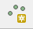
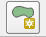
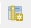

# CopyGeoLayer Data

|Data|Description|Source|How To Recreate|
|---|-----|-----|----|
|`line.geojson`|A single feature (`LINE`) GeoJSON file. (Projected in WGS84 - `EPSG:4326`). |Manually created using QGIS Desktop.| See step-by-step instructions below.|
|`points.geojson`|A multi-feature (`POINTS`) GeoJSON file. (Projected in WGS84 - `EPSG:4326`). Attributes include `id` and `Keep_Field`. `Keep_Field` is filled with randomly assigned `Y` and `N` values.|Manually created using QGIS Desktop.| See step-by-step instructions below.|

# Creating a GeoJSON File in QGIS Desktop (Adding Multiple Features and Multiple Attributes)

| |		|
|-|----|
|1|Open QGIS Desktop.|
|2|In the top menu toolbar, click `Layer`.|
|3|Hover over the `Create Layer` and then click the `New Shapefile Layer...` button.|
|4|The `New Shapfile Layer` window will appear.|
|5|In the `Type` selection box, select the desired feature geometry type (`POINT`, `LINE`, or `POLYGON`).|
|6|In the unnamed drop down menu, select the desired coordinate reference system. To recreate the test data for the `CopyGeoLayer` command, select `(EPSG:4326, WGS84)`. |
|7|Click `OK`.|
|8|The `Save layer as...` window will appear.|
|9|Browse to a safe, but temporary, folder location. Give the file an appropriate name (`POINT`, `LINE`, or `POLYGON` are suggested). 
|10| Click `OK`.|
|11|The newly created shapefile will be added to the `Layers Panel` in QGIS Desktop.|
|12|Right-click on the layer in the `Layers Panel`. Click `Toggle Editing`.|
|13|Click the `Add Feature` button in the top menu bar. It should look something like one of the images in `Appendix A`.|
|14|Click on the QGIS main screen. This will allow the creation of a `POINT`, `LINE` or `POLYGON`.|
|15|The `Feature Attributes` window will appear. Enter `1` for the `id`. Click `OK`.|
|16|Right-click on the layer in the `Layers Panel`. Click `Open Attribute Table`. The `Attribute Table` windown will appear.|
|17|Click the `Add Field` button (shown in `Appendix A`).   The `Add Field` window will appear.   Enter an attribute name in the box next to `Name`.   Select the attribute type in the drop down next to `Type`.   Enter an appropriate attribute length in the box next to `Length`.   Click `OK`.|
|18| The new attribute will be added to the attribute table.   Click each attribute box under the new attribute field and enter appropriate values.   Close the attribute table.|
|19|Right-click on the layer in the `Layers Panel`. Click `Toggle Editing`.|
|20|The `Stop editing` window will appear. Click `Save`. The shapefile now has one feature.|
|20|Right-click on the layer in the `Layers Panel`. Click `Save as...`.|
|22|The `Save vector layer as...` window will appear.|
|23|In the `Format` drop down menu, select `GeoJSON`.|
|24|Click the `Browse` button. Browse to the appropriate `test/data` folder.  Give the file an appropriate name.|
|25|Click `OK`.|

## Appendix A

### Add Feature Button - `POINT`

### Add Feature Button - `LINE`

### Add Feature Button - `POLYGON`

### Add Field Button 

