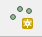
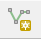
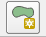

# ReadGeoLayerFromShapefile Data

|Data|Description|Source|How To Recreate|
|---|-----|-----|----|
|`line.shp`|A single feature (`LINE`) Esri shapefile. (Projected in WGS84 - `EPSG:4326`). Shapefile component files are also in the `data` folder (`.cpg`, `.dbf`, `.prj`, `.qgj`, and `.shx`). |Manually created using QGIS Desktop.| See step-by-step instructions below.|
|`point.shp`|A single feature (`POINT`) Esri shapefile. (Projected in WGS84 - `EPSG:4326`). Shapefile component files are also in the `data` folder (`.cpg`, `.dbf`, `.prj`, `.qgj`, and `.shx`).|Manually created using QGIS Desktop.| See step-by-step instructions below.|
|`polygon.shp`|A single feature (`POLYGON`) Esri shapefile. (Projected in WGS84 - `EPSG:4326`). Shapefile component files are also in the `data` folder (`.cpg`, `.dbf`, `.prj`, `.qgj`, and `.shx`).|Manually created using QGIS Desktop.| See step-by-step instructions below.|

# Creating an Esri Shapefile in QGIS Desktop

| |		|
|-|----|
|1|Open QGIS Desktop.|
|2|In the top menu toolbar, click `Layer`.|
|3|Hover over the `Create Layer` and then click the `New Shapefile Layer...` button.|
|4|The `New Shapfile Layer` window will appear.|
|5|In the `Type` selection box, select the desired feature geometry type (`POINT`, `LINE`, or `POLYGON`).|
|6|In the unnamed drop down menu, select the desired coordinate reference system. To recreate the test data for the `CopyGeoLayer` command, select `(EPSG:4326, WGS84)`. |
|7|Click `OK`.|
|8|The `Save layer as...` window will appear.|
|9|Browse to the appropriate `test/data` folder. Give the file an appropriate name (`POINT`, `LINE`, or `POLYGON` are suggested). 
|10| Click `OK`.|
|11|The newly created shapefile will be added to the `Layers Panel` in QGIS Desktop.|
|12|Right-click on the layer in the `Layers Panel`. Click `Toggle Editing`.|
|13|Click the `Add Feature` button in the top menu bar. It should look something like one of the images in `Appendix A`.|
|14|Click on the QGIS main screen. This will allow the creation of a `POINT`, `LINE` or `POLYGON`.|
|15|The `Feature Attributes` window will appear. Enter `1` for the `id`. Click `OK`.|
|16|Right-click on the layer in the `Layers Panel`. Click `Toggle Editing`.|
|17|The `Stop editing` window will appear. Click `Save`. The shapefile now has one feature.|

## Appendix A

### Add Feature Button - `POINT`

### Add Feature Button - `LINE`

### Add Feature Button - `POLYGON`
