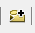
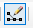
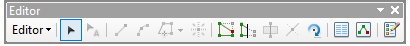
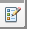
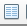

# ReadGeoLayersFromFGBD Data

|Data|Description|Source|How To Recreate|
|---|-----|-----|----|
|`ReadGeoLayersFromFGDb-test.gdb`|An Esri File Geodatabase with the following three feature classes.|Manually created in ArcCatalog. | See step-by-step instructions below.|
|`line` feature class|A single-feature `LINE` feature class projected in WGS84.|Manually created in ArcCatalog/ArcMap. | See step-by-step instructions below.|
|`point` feature class|A single-feature `POINT` feature class projected in WGS84.|Manually created in ArcCatalog/ArcMap | See step-by-step instructions below.|
|`polygon` feature class|A single-feature `POLYGON` feature class projected in WGS84.|Manually created in ArcCatalog/ArcMap. | See step-by-step instructions below.|

# Creating an Esri File Geodatabase. 

|  |  |
|---|---|
|1| Open ArcCatalog.|
|2| In the `Catalog Tree` panel, right-click the `Folder Connections` option. Select `Connect to a Folder...`.|
|3| The `Connect to a Folder` window will appear. Navigate the folder structure to find the folder that the file geodatabase will be saved into. Click `OK`.|
|4| The folder that will contain the file geodatabase can now be viewed in the `Folder Connections` panel. Click on it.|
|5| Right-click inside the folder's `Contents` screen. Click `New` > `File Geodatabase`.|
|6| Give the file geodatabase an appropriate name.|

# Creating a Feature Class
|  |  |
|---|---|
|1| Open ArcCatalog.|
|2| In the `Catolog Tree` panel, navigate to the folder containing the file geodatabase that you would like to create the feature class.|
|3| The file geodatabase should now be in the `Contents` screen.|
|4| Right-click on the file geodatabase and click `New` > `Feature class...`.|
|5| The `New Feature Class` window will appear.|
|6| Give the feature class an appropriate name next to the `Name` option.|
|7| Select the appropriate geometry type in the dropdown menu under the `Type` option. Click `Next>`.|
|8| Navigate to and select the appropriate coordinate reference system. Click `Next>`.|
|9| If desired, set an `XY Tolerance`. Click `Next>`.|
|10| Keep the `Configuration Keyword set to `Default`. Click `Next>`.|
|11| If desired, add `Attributes` (known as `Fields` in Esri software). You must add a `Field Name` and a `Data Type`. Click `Finish`.|
|12| The feature class will now be displayed in the `Contents` screen of the file geodatabase.|
|13| Open ArcMap.|
|14| In the main menu bar, click `File` > `Add Data` > `Add Data..`.|
|15| The `Add Data` window will appear. Click the `Connect to Folder` button (an image of this button is in Appendix A). The `Connect to Folder` window will appear. Navigate to the folder containing the file geodatabase. Click `OK`.|
|16| Use the `Look in:` dropdown menu to open the folder containing the file geodatabase. Click the file geodatabase - it should highlight in blue. Click `Add`. Select the feature class that you created - it should highlight in blue. Click `Add`. It will be added to the `Table of Contents` pane.|
|17| Click the `Editor Toolbar` button (an image of this button is in Appendix A). The `Editor` toolbar will appear. Click `Editor` > `Start Editing`.|
|18| Click the `Create Features` button in the `Editor` toolbar (an image of this button is in Appendix A).|
|19| Click on the main screen. Add the appropriate features. |
|20| Click the `Attributes` button in the `Editor` toolbar (an image of this button is in Appendix A). Edit the attributes as appropriate.|
|21| After the features and attributes have been added, click the `Editor` > `Stop Editing` button. The `Save` window will appear. Click `Yes` to the question `Do you want to save your edits?`.|

## Appendix A

### Connect to Folder Button 

### Editor Toolbar Button

### Editor Toolbar

### Create Features Button

### Attributes Button 

